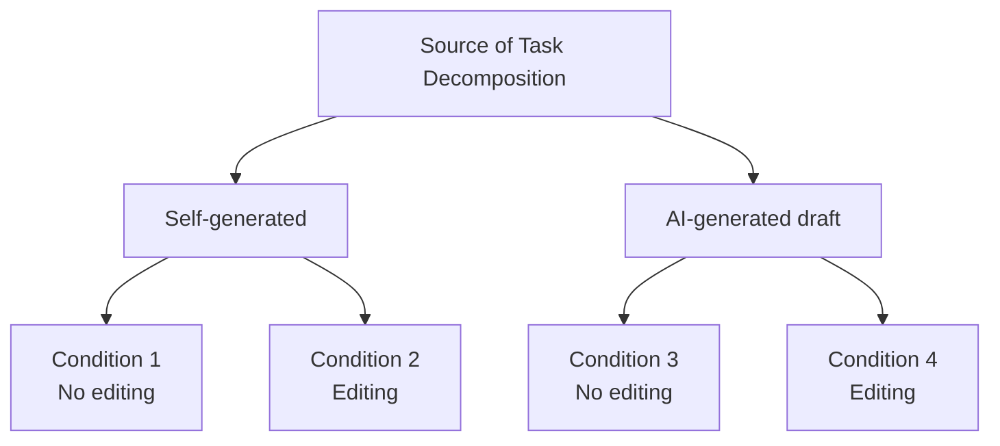
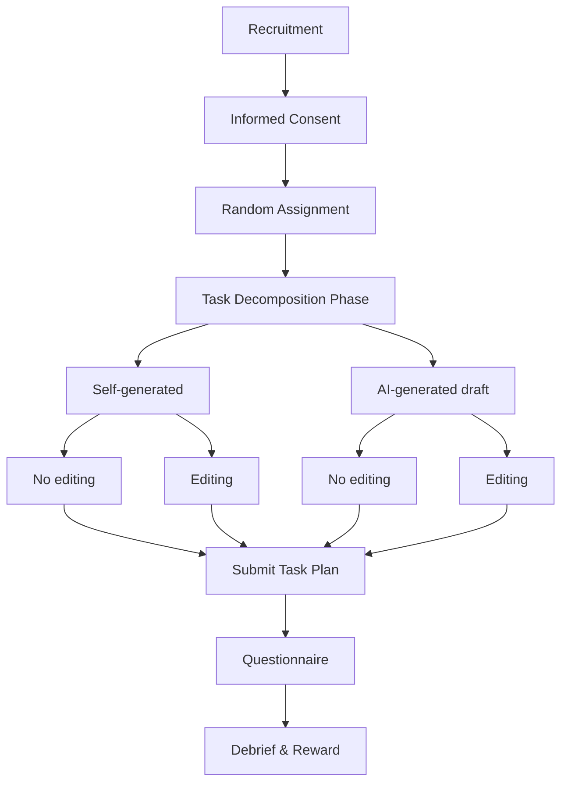
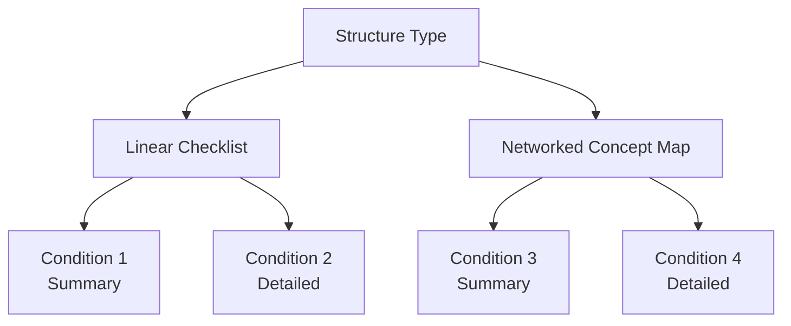
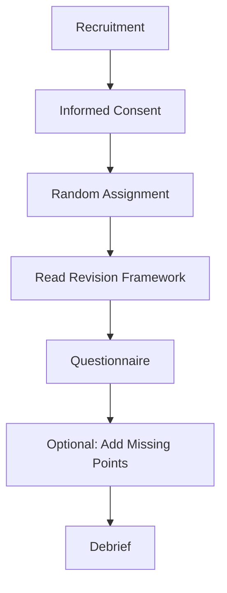
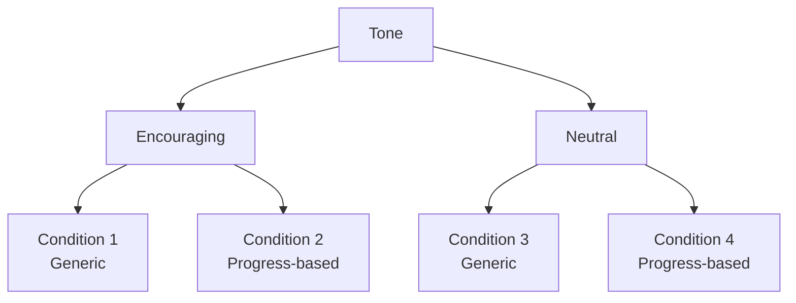
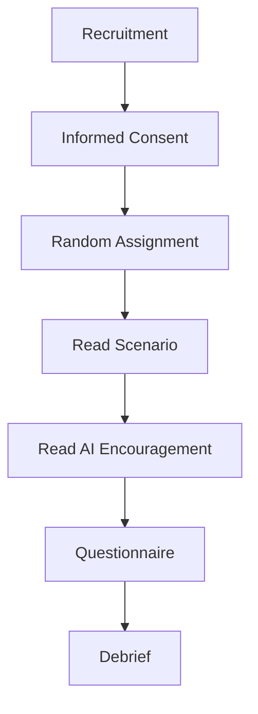

# AI Integration at XJTLU — Project Research Plans

This document presents three candidate experimental study designs for the project topic **AI Integration at XJTLU**. Each plan includes a title, introduction, and full answers to the nine design questions.

---

# Plan 1: AI-Assisted Task Decomposition at XJTLU

## Introduction

This study investigates whether AI-generated task decomposition drafts help XJTLU students produce better task plans, and whether personalizing those drafts adds further value. When students face an unfamiliar task, they often do not know where to start. AI can provide a draft structure, but it is unclear whether this draft improves the quality of students' plans, and whether students benefit more when they personalize the AI draft themselves.

**Research Question:**

When XJTLU students face an unfamiliar task, how do the **source of task decomposition** (self-generated vs. AI-generated draft) and **personalization** (no editing vs. editing) affect the **quality of their task plan** and their **perceived helpfulness**?

---

## 1. Do you need a formative study? Why (not)?

**Yes, we need a formative study.**

Reasons:

- AI integration at XJTLU is broad. We need to understand how students currently decompose unfamiliar tasks and whether they already use AI for this.
- A formative study helps us:
  - Identify what kinds of tasks XJTLU students find hard to start.
  - Understand whether students trust AI-generated task breakdowns.
  - Refine our task materials and questionnaire items.
- Method: short survey + a few interviews with XJTLU students.
- If we skip this, our task may not represent real student needs.

---

## 2. Who will be your participants and what kind of tasks would you let them do?

**Participants:**

- XJTLU undergraduate students
- At least 20 per condition, 4 conditions, 80+ total
- Randomly assigned to one condition

**Tasks:**

Participants receive an unfamiliar task, such as:

- "Plan a campus AI-themed awareness campaign"
- "Design a revision plan for a course"
- "Write an outline for a survey report on AI use at XJTLU"

They then:

- Condition 1: Decompose the task themselves, no editing
- Condition 2: Decompose themselves, then edit their own plan
- Condition 3: Read an AI-generated decomposition draft, no editing
- Condition 4: Read an AI-generated draft, then personalize/edit it

Finally, they submit their task plan and complete a questionnaire.

**Duration:** 10–15 minutes.

---

## 3. If you were asked to design a study about AI integration at XJTLU with two independent variables - what would you select?

**IV1: Source of Task Decomposition**

- Level 1: Self-generated
- Level 2: AI-generated draft

**IV2: Personalization**

- Level 1: No editing
- Level 2: Editing / personalizing

These two variables directly reflect how AI is integrated into students' planning process: whether AI provides a draft, and whether the student makes it their own.

---

## 4. For the two variables, will they be between-group, within-group, or mixed? How many conditions are there?

**Design: 2 × 2 between-group design**

- IV1 is between-group: each participant experiences only one source.
- IV2 is between-group: each participant experiences only one personalization level.

**Number of conditions: 4**

| Condition | Source | Personalization |
|---|---|---|
| 1 | Self-generated | No editing |
| 2 | Self-generated | Editing |
| 3 | AI-generated draft | No editing |
| 4 | AI-generated draft | Editing |

**Why between-group:**

- Avoids learning effects: once participants see an AI draft, they cannot unsee it.
- Avoids carryover effects between conditions.
- Shorter and simpler for each participant.

---

## 5. What do you care about AI integration at XJTLU? What are the dependent variables and what would you measure?

We care about whether AI genuinely improves students' ability to structure unfamiliar tasks, and whether personalization matters.

**Core Dependent Variable:**

- **Task plan quality** — rated by independent coders on:
  - Completeness of steps
  - Logical order
  - Feasibility / executability

**Secondary Dependent Variables:**

| DV | Measurement |
|---|---|
| Task plan quality (core) | Rated by independent coders |
| Perceived helpfulness | Questionnaire |
| Perceived ease of use | Questionnaire |
| Willingness to adopt | Questionnaire |
| Satisfaction | Questionnaire |
| Cognitive load | NASA-TLX (short version) |

If only one DV can be chosen, use **task plan quality**.

---

## 6. What makes a good baseline condition for your project?

**Baseline: Condition 1 — Self-generated, no editing.**

Reasons:

- It represents the traditional way students plan tasks without AI.
- It allows clean comparison:
  - Condition 1 vs. 3: Does an AI draft help?
  - Condition 1 vs. 4: Does AI draft + personalization help most?
  - Condition 3 vs. 4: Does editing an AI draft add value?
- It is realistic and familiar to all participants.

---

## 7. How would you design the experimental procedure? How long will the study last?

**Procedure:**

1. Recruitment and informed consent
2. Random assignment to one of 4 conditions
3. Read task description (2 min)
4. Task decomposition phase (5–8 min)
   - Condition 1: Write steps yourself
   - Condition 2: Write steps, then edit
   - Condition 3: Read AI draft, submit
   - Condition 4: Read AI draft, then edit
5. Submit task plan
6. Questionnaire (3 min)
7. Debrief and reward

**Total duration:** 10–15 minutes.

---

## 8. Can you visualize the experimental conditions using figures?

| Condition | Source | Personalization |
|---|---|---|
| 1 | Self-generated | No editing |
| 2 | Self-generated | Editing |
| 3 | AI-generated draft | No editing |
| 4 | AI-generated draft | Editing |

---

## 9. Can you illustrate your experimental procedure using a figure?

---

# Plan 2: AI-Assisted Revision Framework at XJTLU

## Introduction

This study examines how the **structure** and **detail level** of an AI-generated revision framework affect XJTLU students' perceived quality and willingness to adopt it. Many students use AI to summarize course content, but it is unclear what format of AI-generated revision framework is most useful: a simple linear checklist or a networked concept map, and whether more detail helps or overwhelms.

**Research Question:**

How do the **structure type** (linear checklist vs. networked concept map) and **detail level** (summary vs. detailed) of an AI-generated revision framework affect students' **perceived systematicity** and **adoption intention**?

---

## 1. Do you need a formative study? Why (not)?

**Yes.**

- To understand how XJTLU students currently organize revision.
- To see whether they already use AI to build revision frameworks.
- To identify what they value in a revision framework (structure, detail, examples).
- Method: short survey + a few interviews.

Without this, our framework materials may not reflect real student preferences.

---

## 2. Who will be your participants and what kind of tasks would you let them do?

**Participants:**

- XJTLU undergraduate students
- 20+ per condition, 4 conditions, 80+ total
- Random assignment

**Tasks:**

1. Read an AI-generated revision framework for a course topic.
2. Review it for 3–5 minutes.
3. Complete a questionnaire on perceived systematicity, usefulness, adoption intention, and satisfaction.
4. Optional: add missing knowledge points.

**Duration:** 8–10 minutes.

---

## 3. If you were asked to design a study about AI integration at XJTLU with two independent variables - what would you select?

**IV1: Structure Type**

- Level 1: Linear checklist (chapter-by-chapter list)
- Level 2: Networked concept map (showing relationships)

**IV2: Detail Level**

- Level 1: Summary (titles and keywords only)
- Level 2: Detailed (explanations and examples)

---

## 4. For the two variables, will they be between-group, within-group, or mixed? How many conditions are there?

**Design: 2 × 2 between-group**

**Conditions: 4**

| Condition | Structure | Detail |
|---|---|---|
| 1 | Linear | Summary |
| 2 | Linear | Detailed |
| 3 | Networked | Summary |
| 4 | Networked | Detailed |

**Why between-group:** avoids carryover and keeps each session short.

---

## 5. What do you care about AI integration at XJTLU? What are the dependent variables and what would you measure?

We care about whether AI-generated revision frameworks are perceived as useful and systematic enough to adopt.

**Core DV:**

- **Perceived systematicity** — how complete and well-organized the framework feels.

**Secondary DVs:**

| DV | Measurement |
|---|---|
| Perceived systematicity (core) | Questionnaire |
| Perceived usefulness | Questionnaire |
| Adoption intention | Questionnaire |
| Satisfaction | Questionnaire |
| Cognitive load | NASA-TLX (short version) |

---

## 6. What makes a good baseline condition for your project?

**Baseline: Condition 1 — Linear + Summary.**

- It is the simplest, most traditional form of revision outline.
- It allows comparison:
  - Does adding detail help?
  - Does a networked structure help?
  - Does the combination help most?

---

## 7. How would you design the experimental procedure? How long will the study last?

**Procedure:**

1. Recruitment and consent
2. Random assignment
3. Read revision framework (3–5 min)
4. Questionnaire (3 min)
5. Optional: add missing points (2 min)
6. Debrief

**Total:** 8–10 minutes.

---

## 8. Can you visualize the experimental conditions using figures?

| Condition | Structure | Detail |
|---|---|---|
| 1 | Linear | Summary |
| 2 | Linear | Detailed |
| 3 | Networked | Summary |
| 4 | Networked | Detailed |

---

## 9. Can you illustrate your experimental procedure using a figure?

---

# Plan 3: AI Encouragement and Self-Regulated Learning at XJTLU

## Introduction

This study examines how the **tone** and **specificity** of AI encouragement affect XJTLU students' willingness to study independently. AI tools often provide encouraging messages, but it is unclear whether an encouraging tone actually motivates students, and whether generic encouragement or progress-based encouragement is more effective.

**Research Question:**

How do the **tone** (encouraging vs. neutral) and **specificity** (generic vs. progress-based) of AI encouragement affect students' **self-regulated learning intention**?

---

## 1. Do you need a formative study? Why (not)?

**Yes.**

- To understand what kind of encouragement XJTLU students respond to.
- To check whether AI encouragement feels authentic or artificial.
- Method: short survey + interviews.

---

## 2. Who will be your participants and what kind of tasks would you let them do?

**Participants:**

- XJTLU undergraduates
- 20+ per condition, 4 conditions, 80+ total

**Tasks:**

1. Read a short learning scenario.
2. Receive AI encouragement (tone and specificity vary by condition).
3. Complete a questionnaire on motivation, intention, and emotion.

**Duration:** 5 minutes.

---

## 3. If you were asked to design a study about AI integration at XJTLU with two independent variables - what would you select?

**IV1: Tone**

- Level 1: Encouraging
- Level 2: Neutral

**IV2: Specificity**

- Level 1: Generic
- Level 2: Progress-based

---

## 4. For the two variables, will they be between-group, within-group, or mixed? How many conditions are there?

**Design: 2 × 2 between-group**

**Conditions: 4**

| Condition | Tone | Specificity |
|---|---|---|
| 1 | Encouraging | Generic |
| 2 | Encouraging | Progress-based |
| 3 | Neutral | Generic |
| 4 | Neutral | Progress-based |

---

## 5. What do you care about AI integration at XJTLU? What are the dependent variables and what would you measure?

**Core DV:**

- **Self-regulated learning intention** — willingness to continue studying independently.

**Secondary DVs:**

| DV | Measurement |
|---|---|
| Self-regulated learning intention (core) | Questionnaire |
| Motivation | Questionnaire |
| Emotion | Questionnaire |
| Trust in AI | Questionnaire |
| Satisfaction | Questionnaire |

---

## 6. What makes a good baseline condition for your project?

**Baseline: Condition 3 — Neutral + Generic.**

- It represents minimal AI encouragement.
- Allows comparison with encouraging and progress-based conditions.

---

## 7. How would you design the experimental procedure? How long will the study last?

**Procedure:**

1. Recruitment and consent
2. Random assignment
3. Read scenario (1 min)
4. Read AI encouragement (1 min)
5. Questionnaire (3 min)
6. Debrief

**Total:** 5 minutes.

---

## 8. Can you visualize the experimental conditions using figures?

| Condition | Tone | Specificity |
|---|---|---|
| 1 | Encouraging | Generic |
| 2 | Encouraging | Progress-based |
| 3 | Neutral | Generic |
| 4 | Neutral | Progress-based |

---

## 9. Can you illustrate your experimental procedure using a figure?

---

# Comparison of the Three Plans

| Plan | Core DV | Task | Duration | Recommendation |
|---|---|---|---|---|
| 1: Task Decomposition | Task plan quality | Decompose a task | 10–15 min | Most recommended |
| 2: Revision Framework | Perceived systematicity | Read a revision framework | 8–10 min | Recommended |
| 3: AI Encouragement | Self-regulated learning intention | Read AI encouragement | 5 min | General |

---

# Team

- [Member 1]
- [Member 2]
- [Member 3]

# Course

AI Integration at XJTLU — Project Website
