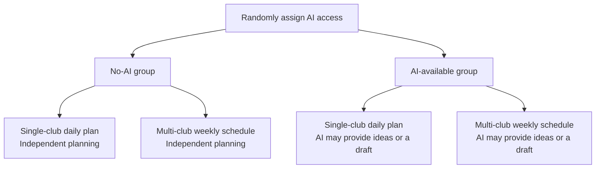
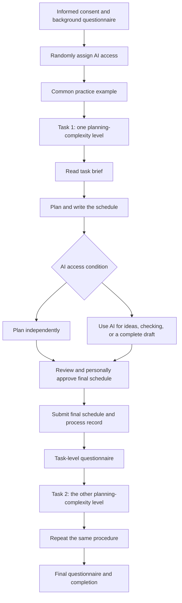
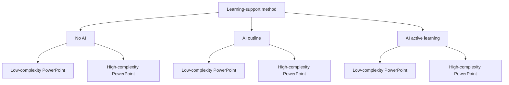
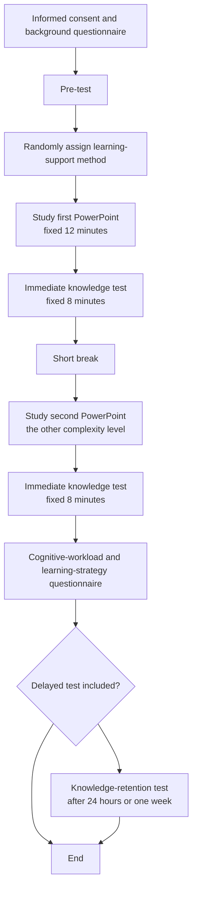

# AI Integration at XJTLU: Experimental Study Designs

This document focuses on **AI Integration at XJTLU**. The two study designs examine:

- Whether using AI changes students' performance on realistic learning tasks.
- Whether different forms of AI support produce different outcomes.
- Whether AI improves the quality of students' work and learning, rather than only making tasks faster or easier.

The two designs are structured around the nine questions proposed by the instructor:

1. Whether a formative study is needed.
2. Who the participants are and what tasks they will complete.
3. The two independent variables.
4. Whether the variables are between-subjects, within-subjects, or mixed, and how many conditions there are.
5. The dependent variables and how they will be measured.
6. The baseline condition.
7. The experimental procedure and duration.
8. A figure showing the experimental conditions.
9. A figure showing the experimental procedure.

---

# Study 1: The Effect of AI Planning Support on the Quality of XJTLU Club Activity Planning

## Study Design

This study investigates whether access to AI assistance improves students' ability to produce a complete and feasible student-club activity plan. The experimental comparison is deliberately simple:

- One group plans independently without AI.
- One group may use AI during planning.
- Both groups receive the same task information, the same time limit, and the same output template.
- Both final plans are scored against the same researcher-developed reference checklist.

The AI condition does not require one particular way of using AI. Participants may ask AI for ideas, ask it to identify requirements, request a complete draft, or combine these forms of assistance. However, the participant remains responsible for checking the output and submitting only a plan they consider appropriate. This reflects realistic AI integration more closely than forcing every participant to follow an artificial editing procedure.

The experiment therefore tests whether AI access improves the final result under a realistic but controlled time limit.

## Task Materials

Participants will act as student-club managers at XJTLU. They will complete two scheduling tasks with the same output format but different levels of planning complexity. The tasks are designed to be understandable without specialist knowledge and to resemble realistic campus-management activities.

### Simple Task: Plan a One-Day Activity for One Club

Participants are given a short activity brief for one student club, such as a cultural club or sports club. They must plan one activity day.

They receive:

- The activity date or available date range.
- The expected number of participants.
- The activity duration.
- A list of available rooms or locations.
- Opening hours and room-capacity information.
- Basic activity requirements, such as equipment or accessibility needs.

They must produce:

- The activity time.
- The selected location.
- The activity schedule.
- The staff and equipment requirements.
- A final plan that satisfies the information in the task brief.

This task mainly requires the participant to satisfy explicit time, location, capacity, and resource requirements.

### Complex Task: Plan a One-Week Schedule for Multiple Clubs

Participants are responsible for scheduling activities for several student clubs during one week. The clubs share rooms, equipment, and a limited number of student staff members.

They receive:

- Several clubs with different activity needs.
- Several possible time slots during one week.
- A set of rooms with different capacities and equipment.
- Club-specific availability constraints.
- Shared staff and equipment constraints.
- Requirements that activities must not overlap for the same club, room, staff member, or shared equipment.

They must produce:

- A weekly schedule for all clubs.
- Time and location assignments for each activity.
- Staff and equipment allocations.
- A list of conflicts or trade-offs, if any, and an explanation of how they were resolved.

Unlike the simple task, the participant must decide how to allocate time, locations, staff, and equipment while avoiding conflicts. The task therefore involves constraint management and trade-offs rather than only checking whether one activity meets a fixed set of requirements.

Both tasks should use the same answer template, time limit, and scoring dimensions. Complexity is manipulated through the number of activities, shared resources, interdependent constraints, and decisions that must be made. A pilot study will confirm that the weekly multi-club task is more difficult than the single-club task.

## Reference Checklist for Scoring

Before the experiment, the researchers will prepare one common reference-checklist framework, with task-specific items for the single-club and multi-club tasks. The checklist is based only on the requirements stated in the task brief. It is not generated separately for different participants.

The checklist will include objectively scorable items such as:

- Every required activity is included.
- Every activity has a valid time slot.
- Each room is suitable for the expected number of participants.
- Room opening hours and room availability are respected.
- Required staff members are available.
- Required equipment is available.
- No club, room, staff member, or shared equipment is double-booked.
- All activity-specific constraints are satisfied.
- Any unavoidable conflict is explicitly identified and handled.

The reference checklist is the common standard for both conditions and both task types. Participants do not need to reproduce the wording of the checklist; they need to produce a plan that satisfies the requirements in the task brief. The final score is the number or proportion of checklist items correctly satisfied, with additional quality points for justified conflict resolution where relevant.

**Research questions:**

1. Does access to AI assistance improve the number of reference-checklist requirements satisfied?
2. Is the benefit of AI greater for multi-club weekly scheduling than for single-club daily planning?
3. Does AI improve plan completeness and constraint satisfaction within the same time limit?
4. Do participants in the AI condition use AI as a source of ideas, a complete draft, a checking tool, or a combination of these?

---

## 1. Do We Need a Formative Study? Why?

**Yes.**

The formative study is needed to check whether the tasks are realistic, understandable, and appropriately difficult. It should not be used to prove that AI is effective.

The formative study should examine:

- Whether XJTLU students understand the role of a student-club manager and consider the scheduling tasks realistic.
- Whether the single-club daily task and the multi-club weekly task produce different levels of difficulty.
- Whether the task constraints and deliverables are clear.
- Whether the reference checklist contains all necessary requirements and no irrelevant requirements.
- Whether the scoring procedure can distinguish between lower- and higher-quality schedules.

We would conduct a pilot study with approximately 8-12 students:

1. Ask them to complete both tasks.
2. Record completion time and the quality of their submitted plans.
3. Ask which requirements they found most difficult.
4. Revise the task materials, reference checklist, and scoring procedure based on their feedback.

---

## 2. Who Are the Participants and What Tasks Will They Complete?

### Participants

- XJTLU undergraduate students or taught postgraduate students.
- Participants' year of study, discipline, AI-use frequency, and previous AI training will be recorded.
- A realistic target is 48-64 participants for the formal study.

The study uses a mixed design. AI access is a between-subjects variable, while planning complexity is a within-subjects variable.

Each participant will complete:

- One single-club daily-planning task.
- One multi-club weekly-scheduling task.

Task order will be counterbalanced. Half of the participants will complete the single-club task first, and the other half will complete the multi-club task first. The task materials should use different clubs and activity details while keeping the information structure, time limits, and scoring criteria equivalent.

### No-AI Condition

Participants may use the task brief, paper, or a standard text editor. They may not use generative AI, search engines, or automated scheduling tools.

They will:

1. Read the task brief.
2. Produce the activity plan using their own reasoning.
3. Review the completed plan before submission.
4. Submit the plan as their final answer.

They are not given a separate task-specific checklist during planning. The researcher-developed reference checklist is used later for scoring.

### AI-Available Condition

Participants receive access to the same task brief and may use the experiment-provided AI assistant during the planning period. They may use AI in any of the following realistic ways:

- Ask for planning ideas.
- Ask AI to organise the requirements.
- Ask AI to propose a schedule.
- Ask AI to generate a complete draft.
- Ask AI to check, explain, or improve their own plan.

Participants must:

1. Use the same task brief as the no-AI group.
2. Work within exactly the same time limit.
3. Review the AI output and decide whether it is suitable.
4. Submit only a plan that they personally approve as their final answer.
5. Save the AI interaction record so that the type and amount of AI assistance can be analysed.

The AI-available condition measures AI integration as access to a planning partner. It does not assume that every participant will use AI in the same way. AI can provide ideas or a complete draft, but the participant must make the final submission decision.

---

## 3. What Two Independent Variables Would You Select?

### Independent Variable 1: AI Access

- Level 1: No AI access.
- Level 2: AI access during planning.

This is a between-subjects variable. Each participant experiences only one access condition because using AI first could influence performance in a later no-AI condition.

### Independent Variable 2: Planning Complexity

- Level 1: Single-club, one-day planning.
- Level 2: Multi-club, one-week scheduling.

This is a within-subjects variable. Every participant completes one task at each complexity level, allowing performance to be compared within the same participant.

Together, these variables allow us to examine:

- Whether access to AI is generally helpful.
- Whether complex scheduling tasks benefit more from AI access.
- Whether there is an interaction between AI access and planning complexity.

---

## 4. Are the Variables Between-Subjects, Within-Subjects, or Mixed? How Many Conditions Are There?

**Recommended design: a 2 × 2 mixed design.**

| Variable | Design type | Levels |
|---|---|---|
| AI access | Between-subjects | No AI access; AI access |
| Planning complexity | Within-subjects | Single-club daily planning; multi-club weekly scheduling |

There are four combinations of conditions:

| Condition | AI access | Planning complexity |
|---|---|---|
| 1 | No AI access | Single-club daily planning |
| 2 | No AI access | Multi-club weekly scheduling |
| 3 | AI access | Single-club daily planning |
| 4 | AI access | Multi-club weekly scheduling |

However, each participant belongs to only one support-method group and completes both complexity conditions:

- Group A: No AI access + single-club task; no AI access + multi-club task.
- Group B: AI access + single-club task; AI access + multi-club task.

### Why Not Use a Pure Between-Subjects Design?

If each participant completed only one scheduling task, individual differences in planning ability would have a strong influence on the results. Asking every participant to complete one single-club task and one multi-club task reduces this source of variability.

### Why Is AI Access Between-Subjects?

If the same participant first uses AI and then is asked to work without AI, the strategies, ideas, and experience gained from AI use may carry over into the no-AI condition. This would contaminate the comparison.

---

## 5. What Do You Care About? What Are the Dependent Variables?

The study examines whether access to AI helps students produce schedules that satisfy more of the task requirements while preserving the participant's responsibility for the final answer.

### Primary Dependent Variable: Reference-Checklist Score

The researcher-developed reference checklist is the same for both conditions. Two independent raters who do not know the experimental condition will score the anonymised final plans against this checklist.

| Dimension | Scoring focus | Score |
|---|---|---|
| Requirement coverage | Number or proportion of required checklist items satisfied | 0-1 per item |
| Constraint satisfaction | Number or proportion of explicit constraints satisfied | 0-1 per item |
| Resource allocation | Whether time, locations, staff, and equipment are assigned without invalid overlaps | 0-1 per item |
| Feasibility | Whether the submitted schedule can actually be implemented | 0-1 per item |
| Conflict handling | Whether unavoidable conflicts are identified and handled in a justified way | 0-1 or rubric score |

The primary score will be the total number or proportion of reference-checklist items satisfied. A higher score means that the final plan matches more of the requirements in the task brief.

### Secondary Dependent Variables

| Dependent variable | Measurement |
|---|---|
| Completion time | Automatically recorded or recorded by the researcher |
| Cognitive workload | Short NASA-TLX |
| Perceived helpfulness | Seven-point Likert scale |
| AI-use pattern | Coded from the interaction record: ideas, requirement organisation, draft generation, checking, or mixed use |
| Human approval judgement | Participant's rating of whether the final plan is suitable and complete |
| AI reliance | Degree to which participants accept AI output without checking it |

The main outcome is the final reference-checklist score. Completion time and workload show whether any quality difference is accompanied by an efficiency difference. The AI interaction record shows how participants used AI, but AI-use pattern is exploratory rather than a second manipulated variable.

---

## 6. What Is a Good Baseline Condition?

**Baseline condition: no AI access.**

The no-AI condition is the most direct baseline because participants must independently interpret the task brief and produce their own schedule. The researcher-developed reference checklist is not a support tool that differs between conditions. It is the common scoring standard applied after submission.

This creates a clean comparison:

- Both groups receive the same task brief.
- Both groups use the same answer template.
- Both groups have the same time limit.
- Both groups must personally approve and submit their final plan.
- Both groups are scored against the same reference checklist.
- The only manipulated difference is whether AI assistance is available during planning.

Key comparisons are:

- AI access versus no AI access for the single-club task.
- AI access versus no AI access for the multi-club task.
- Multi-club scheduling versus single-club planning.
- The interaction between AI access and planning complexity.

---

## 7. How Will You Design the Procedure? How Long Will It Last?

### Procedure

1. Recruit participants and obtain informed consent.
2. Complete a background questionnaire covering discipline, year of study, and AI experience.
3. Randomly assign participants to the no-AI group or AI-available group.
4. Provide common instructions and a short practice example.
5. Complete the first task:
   - Read the task brief: 3 minutes.
   - Plan and write the schedule: 20 minutes.
6. Complete a task-level workload questionnaire: 3 minutes.
7. Take a short break: 2 minutes.
8. Complete the second task at the other complexity level using the same time limits.
9. Complete the final questionnaire and finish the study.

### Duration

- Approximately 25 minutes per task.
- Approximately 60 minutes including instructions, the break, and questionnaires.

The AI and no-AI groups must receive the same total amount of time. The AI group must not receive extra time simply because AI can generate text quickly. The AI interface should log prompts, outputs, and the time at which AI was used.

### Planned Comparisons

The main analysis will compare the two access groups on the final reference-checklist score for both planning-complexity levels. The score should be calculated as the number or proportion of checklist items satisfied. Completion time and workload will be analysed as secondary outcomes.

The study should also test the interaction between AI access and planning complexity:

- If the AI group satisfies more checklist items on both tasks, access to AI may provide a general planning benefit.
- If the AI group performs significantly better only on the multi-club task, AI may be especially useful when schedules contain interdependent constraints.
- If AI reduces time without improving the checklist score, AI may mainly improve perceived efficiency rather than planning quality.
- If the AI group has a higher checklist score despite using AI in different ways, the result would support the value of AI access as an integrated planning resource rather than one fixed AI function.

---

## 8. Can You Visualise the Experimental Conditions?

| AI access | Single-club daily plan | Multi-club weekly schedule |
|---|---|---|
| No AI access | Independent planning | Independent planning |
| AI access | Participant-approved AI-assisted plan | Participant-approved AI-assisted plan |

---

## 9. Can You Visualise the Experimental Procedure?

---

# Study 2: The Effect of AI-Supported PowerPoint Learning on Knowledge Gain and Retention

## Study Design

This study directly examines whether AI helps students learn the content of PowerPoint lecture materials. It does not treat the visual format of a summary as the main research question.

Participants will study two lecture decks related to AI integration at XJTLU within fixed time limits and then complete knowledge tests. The study compares:

- Reading the PowerPoint without AI.
- Using AI to extract an outline from the PowerPoint.
- Using AI to extract an outline and support active retrieval practice.

This allows us to compare both AI use versus no AI use and different levels of AI integration.

## Learning Materials

Two topic-different but difficulty-matched PowerPoint decks will be prepared.

### Deck A: Generative AI in University Learning

The deck covers:

- Basic ideas about how generative AI works.
- Common uses of AI in learning.
- Output verification and hallucination.

### Deck B: Responsible AI Use at XJTLU

The deck covers:

- Academic integrity.
- Privacy and data security.
- Transparency and responsible AI use.

Each deck should contain approximately 12-15 slides and a similar number of core knowledge points.

## Learning-Material Complexity

Each deck can be prepared in two versions:

- Low-complexity version: relationships between concepts are direct, examples are limited, and the structure is straightforward.
- High-complexity version: concepts involve more conditions, exceptions, and interrelationships, requiring learners to integrate several pieces of information.

Complexity should not be created only by adding more words. It should be manipulated through the relationships between information and the amount of integration or reasoning required. A pilot study must confirm that the high-complexity version is actually more difficult to understand.

To avoid confounding deck topic with complexity, the mapping should be counterbalanced:

- Half of the participants study Deck A in the low-complexity version and Deck B in the high-complexity version.
- The other half study Deck A in the high-complexity version and Deck B in the low-complexity version.

Deck order should also be counterbalanced. Half of the participants study Deck A first, and the other half study Deck B first.

## AI-Support Conditions

To avoid differences in participants' prompting ability, the study should use a standardised AI interface and fixed functions. The AI outlines and retrieval questions should be generated and checked in advance by the researchers rather than generated separately for each participant.

### No-AI Condition

- Participants may read the PowerPoint and take ordinary notes.
- They may not use generative AI.

### AI Outline Condition

- AI provides a structured outline based on the same PowerPoint.
- The outline includes topics, subtopics, and key conceptual relationships.
- AI does not provide answers to the knowledge test or additional explanations.
- Participants may read the PowerPoint and the fixed AI outline within the same time limit.

### AI Active-Learning Condition

- AI provides the same type of structured outline.
- AI also provides knowledge-check questions.
- Participants must attempt to answer the questions before viewing AI feedback.
- AI does not complete the final knowledge test for the participant.

The study does not treat “reading an AI output and submitting it” as learning. Participants must read the original lecture material, process the content, and complete an independent knowledge test.

### Simplified Two-Group Version

If the three-group design is too difficult to implement, the study can be simplified to two learning-support conditions while keeping the same core research question:

- **PowerPoint-only group:** participants study the PowerPoint and take ordinary notes.
- **AI-assisted group:** participants study the same PowerPoint and use a fixed AI-generated outline while learning.

The two groups should receive the same PowerPoint materials, the same study time, and the same knowledge tests. Participants in the AI-assisted group should still read the original PowerPoint rather than relying only on the outline.

This version produces a **2 × 2 mixed design**:

| Variable | Design type | Levels |
|---|---|---|
| Learning-support method | Between-subjects | PowerPoint only; PowerPoint plus AI outline |
| PowerPoint complexity | Within-subjects | Low complexity; high complexity |

The main comparisons are:

- PowerPoint plus AI outline versus PowerPoint only.
- The effect of PowerPoint complexity.
- The interaction between AI support and PowerPoint complexity.

The two-group version is easier to explain, requires fewer participants, and is more feasible for a course project. The three-group version is more informative because it distinguishes outline generation from active-learning support, but it requires a larger sample and a longer procedure.

**Research questions:**

1. Does an AI-generated outline produce higher knowledge-test scores than reading the PowerPoint without AI?
2. Is AI-supported active learning more effective than outline extraction alone?
3. Is AI more helpful for high-complexity PowerPoint material than for low-complexity material?
4. Can AI improve delayed knowledge retention as well as immediate test performance?

---

## 1. Do We Need a Formative Study? Why?

**Yes.**

The formative study should test the PowerPoint materials, AI outputs, and knowledge tests together. This is necessary to ensure that the final study measures learning rather than differences in material length or item difficulty.

The formative study should check:

- Whether the two decks contain similar numbers of core knowledge points.
- Whether the high-complexity versions require more integration and reasoning.
- Whether the AI outlines are accurate and do not introduce additional knowledge.
- Whether the AI-generated retrieval questions cover the core knowledge rather than irrelevant details.
- Whether the pre-test and post-test items have adequate difficulty and discrimination.
- Whether students can complete the learning task within the time limit.

We would conduct a pilot with approximately 10-15 students:

1. Measure the time required to study each deck.
2. Ask them to complete a pre-test, immediate post-test, and delayed test.
3. Interview them about clarity and difficulty.
4. Revise the decks and knowledge tests based on the results.

---

## 2. Who Are the Participants and What Tasks Will They Complete?

### Participants

- XJTLU undergraduate students.
- Students who have already completed systematic training on the same topics should ideally be excluded, or their prior knowledge should be measured and controlled statistically.
- A realistic target is 60-90 participants for the formal study.

### Participant Tasks

1. Complete a learning pre-test.
2. Study the first PowerPoint within a fixed time.
3. Use the assigned learning-support method.
4. Complete an immediate knowledge test for the first deck.
5. Take a short break and study the second PowerPoint.
6. Complete an immediate knowledge test for the second deck.
7. Complete questionnaires on cognitive workload and learning strategy.
8. Complete a delayed knowledge test 24 hours or one week later.

### Knowledge-Test Design

The knowledge questionnaire must measure actual learning rather than asking only whether participants feel that they learned.

Each PowerPoint should have an equivalent knowledge test containing:

- Factual-recognition items testing key concepts.
- Conceptual-understanding items testing relationships between concepts.
- Scenario-based application items situated in an XJTLU learning context.
- Transfer items requiring the learner to apply principles to a new case.

Example conceptual-understanding item:

> Why should students not judge the accuracy of an AI answer solely from the answer itself?

Example scenario-based application item:

> A student wants AI to revise part of a course assignment. Which action is most consistent with responsible AI use?

Example transfer item:

> A student enters interview records containing personal information into a public AI tool. What is the main risk, and how should the student improve the procedure?

Each test should contain approximately 12-15 items. The pre-test and post-test should use different but equivalent items so that participants are not simply remembering the test questions.

---

## 3. What Two Independent Variables Would You Select?

### Independent Variable 1: Learning-Support Method

Three levels are recommended:

- Level 1: No AI; read the PowerPoint and take ordinary notes.
- Level 2: AI outline; use an AI-generated outline to organise the PowerPoint information.
- Level 3: AI outline plus active retrieval practice and feedback.

This is a between-subjects variable. Each participant experiences only one learning-support method, because seeing an AI outline could influence later performance in a no-AI condition.

### Independent Variable 2: PowerPoint Complexity

- Level 1: Low-complexity PowerPoint.
- Level 2: High-complexity PowerPoint.

This is a within-subjects variable. Each participant studies one low-complexity deck and one high-complexity deck, with deck topic and order counterbalanced.

---

## 4. Are the Variables Between-Subjects, Within-Subjects, or Mixed? How Many Conditions Are There?

**Recommended design: a 3 × 2 mixed design.**

| Variable | Design type | Levels |
|---|---|---|
| Learning-support method | Between-subjects | No AI; AI outline; AI active learning |
| PowerPoint complexity | Within-subjects | Low complexity; high complexity |

There are six combinations of conditions:

| Condition | Learning-support method | PowerPoint complexity |
|---|---|---|
| 1 | No AI | Low complexity |
| 2 | No AI | High complexity |
| 3 | AI outline | Low complexity |
| 4 | AI outline | High complexity |
| 5 | AI active learning | Low complexity |
| 6 | AI active learning | High complexity |

Each participant belongs to only one learning-support group but studies both complexity levels.

### Why Use This Design?

- No AI versus AI outline directly tests whether AI helps students organise and understand the PowerPoint.
- AI outline versus AI active learning compares passive information organisation with active learning support.
- Low complexity versus high complexity tests whether AI is more valuable when the learning material is harder.
- The support-method × complexity interaction tests whether the effect of AI depends on material complexity.

If the available sample or time is limited, use the simplified two-group version described above:

- PowerPoint only.
- PowerPoint plus AI outline.

This produces a 2 × 2 mixed design. It is easier to implement and analyse, but it cannot compare outline extraction with active-learning feedback.

---

## 5. What Do You Care About? What Are the Dependent Variables?

The study examines whether AI genuinely helps students acquire, retain, and apply knowledge from lecture materials.

### Primary Dependent Variable

**Knowledge-test performance.**

The main outcomes are:

- Immediate post-test score.
- Learning gain from pre-test to immediate post-test.
- Delayed post-test score.
- Performance on scenario-based application and transfer items.

### Secondary Dependent Variables

| Dependent variable | Measurement |
|---|---|
| Study time | System recording with the same maximum time for all conditions |
| Knowledge retention | Delayed post-test after 24 hours or one week |
| Cognitive workload | Short NASA-TLX |
| Perceived difficulty | Seven-point scale |
| Learning engagement | Whether participants read the material and completed the AI checks |
| Quality of AI use | Whether participants checked the outline and corrected AI errors |
| Learning strategy | Whether participants self-tested or only read the summary |
| Perceived usefulness and adoption intention | Secondary seven-point scales |

Perceived usefulness and adoption intention may be measured, but they must remain secondary outcomes rather than substitutes for the knowledge test.

### Planned Comparisons

The main analysis will compare the three learning-support groups on immediate and delayed post-test performance while controlling for pre-test knowledge. The following outcomes should also be examined:

- Learning gain: immediate post-test minus pre-test.
- Knowledge retention: delayed post-test performance.
- Complexity difference: high-complexity score minus low-complexity score.
- The interaction between learning-support method and PowerPoint complexity.

Possible interpretations include:

- If the AI-outline group scores higher than the no-AI group, AI may help students organise the lecture material.
- If the AI active-learning group scores higher than the AI-outline group, retrieval practice and feedback may be more effective than summary generation alone.
- If AI improves immediate scores but not delayed scores, it may support short-term performance without improving long-term learning.
- If AI produces a benefit only for high-complexity material, its value may depend on learning-material complexity.

---

## 6. What Is a Good Baseline Condition?

**Baseline condition: read the PowerPoint and take ordinary notes without AI.**

This condition most directly represents how students study the lecture material without AI.

It allows three core comparisons:

- AI outline versus no AI: Does AI help students organise the PowerPoint content?
- AI active learning versus no AI: Does deeper AI integration improve learning?
- AI active learning versus AI outline: Are retrieval and feedback more effective than summary generation alone?

All conditions should:

- Study the same or difficulty-matched PowerPoint materials.
- Use the same learning time.
- Complete equivalent pre-tests, immediate post-tests, and delayed post-tests.

---

## 7. How Will You Design the Procedure? How Long Will It Last?

### Single-Session Procedure

1. Informed consent and background questionnaire: 5 minutes.
2. Overall pre-test: 5 minutes.
3. Random assignment to one learning-support method.
4. Study the first PowerPoint: 12 minutes.
5. Complete the immediate knowledge test: 8 minutes.
6. Take a short break: 3 minutes.
7. Study the second PowerPoint at the other complexity level: 12 minutes.
8. Complete the second immediate knowledge test: 8 minutes.
9. Complete the cognitive-workload and learning-strategy questionnaire: 5 minutes.

The single session will last approximately 55-60 minutes.

### Delayed Test

If feasible, participants will complete a delayed post-test 24 hours or one week later. This should take approximately 10 minutes.

The delayed test is important because an AI-generated summary may improve immediate recognition without improving long-term memory or transfer.

### Time Control

Time limits are essential:

- Each PowerPoint has a fixed 12-minute study period.
- Each knowledge test has a fixed 8-minute period.
- The AI groups do not receive extra study time because AI can generate an outline quickly.
- The study records whether participants opened and used the AI outline and whether they completed the retrieval questions.

---

## 8. Can You Visualise the Experimental Conditions?

| Learning-support method | Low-complexity PowerPoint | High-complexity PowerPoint |
|---|---|---|
| No AI | PowerPoint plus ordinary notes | PowerPoint plus ordinary notes |
| AI outline | PowerPoint plus a structured AI outline | PowerPoint plus a structured AI outline |
| AI active learning | PowerPoint plus outline and retrieval feedback | PowerPoint plus outline and retrieval feedback |

---

## 9. Can You Visualise the Experimental Procedure?

