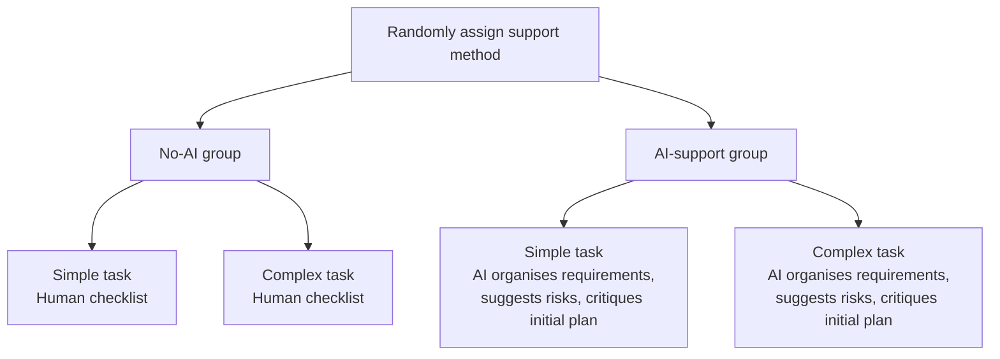
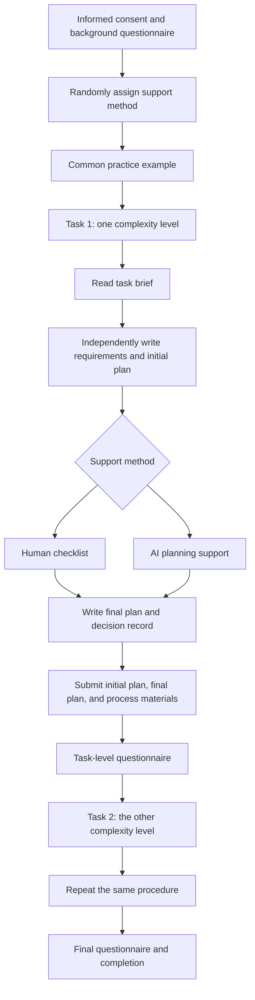
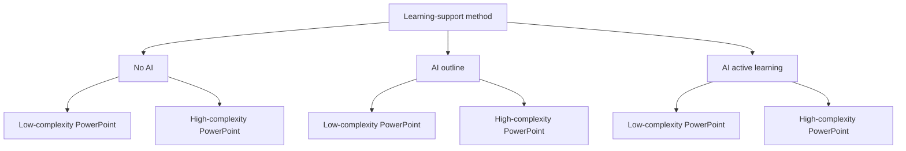
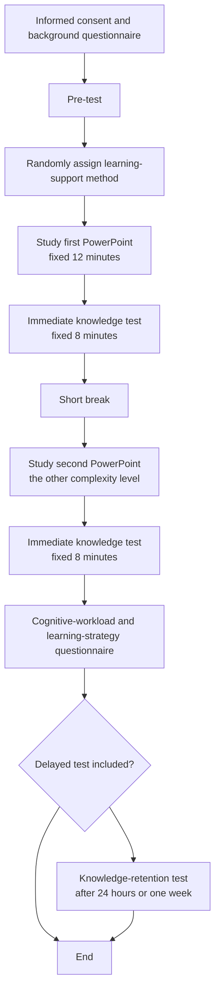

# AI Integration at XJTLU: Experimental Study Designs

This document focuses on **AI Integration at XJTLU**. The two study designs examine:

- Whether using AI changes students' performance on realistic learning tasks.
- Whether different forms of AI support produce different outcomes.
- Whether AI improves the quality of students' work and learning, rather than only making tasks faster or easier.

The two designs are structured around the nine questions proposed by the instructor:

1. Whether a formative study is needed.
2. Who the participants are and what tasks they will complete.
3. The two independent variables.
4. Whether the variables are between-subjects, within-subjects, or mixed, and how many conditions there are.
5. The dependent variables and how they will be measured.
6. The baseline condition.
7. The experimental procedure and duration.
8. A figure showing the experimental conditions.
9. A figure showing the experimental procedure.

---

# Study 1: The Effect of AI Planning Support on the Quality of Complex XJTLU Tasks

## Study Design

This study investigates whether AI helps XJTLU students complete a realistic campus-planning task, and whether the usefulness of AI changes as task complexity increases.

Participants will not simply copy an AI-generated answer and submit it. Every participant must:

1. Read the task materials independently.
2. Write their own understanding of the requirements and an initial plan.
3. Use either AI support or a non-AI support method during a fixed support stage.
4. Produce a final plan based on the support they received.
5. Submit both the initial plan and final plan, together with a short decision record.

The study therefore compares a complete human task-planning process rather than comparing direct submission with an artificial “editing” instruction.

## Task Materials

Participants will complete two tasks with the same general format but different levels of complexity. Both tasks require them to design an AI-literacy activity for XJTLU students. They use the same output requirements, time limits, and scoring criteria.

### Simple Task: Design an XJTLU Student AI Workshop

- Target group: first-year undergraduate students.
- Duration of the workshop: 90 minutes.
- Number of participants: approximately 30.
- Required elements: learning objectives, activity schedule, required resources, and evaluation methods.
- Main constraints: approximately four.

### Complex Task: Design an XJTLU Student AI-Literacy Programme

- Target group: first-year students from different schools or departments.
- Programme duration: four weeks.
- Number of participants: approximately 120.
- Stakeholders: students, teachers, the library, and school administrators.
- Required considerations: academic integrity, privacy, budget, disciplinary differences, and outcome evaluation.
- Main constraints: approximately eight to ten interrelated constraints.

Task complexity will not be manipulated only by making one task longer. It will be manipulated through the number of constraints, number of stakeholders, and dependencies between requirements. A small pilot study will be used to confirm that the complex task is actually more difficult.

**Research questions:**

1. Compared with no AI support, does AI planning support improve the quality of the final task plan?
2. Is the benefit of AI greater for the complex task than for the simple task?
3. Does AI improve task quality, or does it mainly reduce completion time and perceived workload?
4. Can students evaluate which AI suggestions should be adopted, modified, or rejected?

---

## 1. Do We Need a Formative Study? Why?

**Yes.**

The formative study is needed to check whether the tasks are realistic, understandable, and appropriately difficult. It should not be used to prove that AI is effective.

The formative study should examine:

- Whether XJTLU students consider the AI-literacy planning task realistic.
- Whether the simple and complex tasks produce different levels of difficulty.
- Whether the task constraints and deliverables are clear.
- Whether the scoring rubric can distinguish between lower- and higher-quality plans.
- Whether the AI-use instructions are clear.

We would conduct a pilot study with approximately 8-12 students:

1. Ask them to complete both tasks.
2. Record completion time and the quality of their initial and final plans.
3. Ask which requirements they found most difficult.
4. Revise the task materials and scoring rubric based on their feedback.

---

## 2. Who Are the Participants and What Tasks Will They Complete?

### Participants

- XJTLU undergraduate students or taught postgraduate students.
- Participants' year of study, discipline, AI-use frequency, and previous AI training will be recorded.
- A realistic target is 48-64 participants for the formal study.

The study uses a mixed design. AI support is a between-subjects variable, while task complexity is a within-subjects variable.

Each participant will complete:

- One simple task.
- One complex task.

Task order will be counterbalanced. Half of the participants will complete the simple task first, and the other half will complete the complex task first. The two task versions should also be different but equivalent in wording and structure, so that participants do not simply repeat the same plan.

### No-AI Condition

Participants may use the task brief, paper, or a standard text editor. They may not use generative AI, search engines, or automated writing tools.

They will:

1. Read the task brief.
2. Write a requirements list and an initial plan.
3. Use a standard human checklist to review the plan.
4. Submit the final plan.
5. Explain what they changed and why.

### AI-Support Condition

Participants may use an experiment-provided AI assistant. They may not copy a complete AI-generated answer as their final plan. AI support is limited to three functions:

1. Organising the task requirements and stakeholders.
2. Suggesting possible steps, risks, or evaluation indicators.
3. Critiquing the participant's initial plan and identifying possible omissions.

Participants must:

1. Write their own understanding and initial plan before using AI.
2. Save the AI interaction record.
3. Complete a decision table showing which AI suggestions they adopted, modified, or rejected.
4. Evaluate at least three AI suggestions and explain the reason for each decision. They are not forced to reject any suggestion; adoption, modification, and rejection may all be reasonable outcomes.

This means that the AI condition measures how students integrate AI into their own planning process, rather than whether they are willing to submit an AI-generated answer.

---

## 3. What Two Independent Variables Would You Select?

### Independent Variable 1: Planning Support Method

- Level 1: No AI support, using a human checklist.
- Level 2: AI support, using the experiment-provided AI assistant.

This is a between-subjects variable. Each participant experiences only one support method because prior AI use could influence performance in a later no-AI condition.

### Independent Variable 2: Task Complexity

- Level 1: Simple task.
- Level 2: Complex task.

This is a within-subjects variable. Every participant completes one task at each complexity level, allowing performance to be compared within the same participant.

Together, these variables allow us to examine:

- Whether AI is generally helpful.
- Whether complex tasks benefit more from AI support.
- Whether there is an interaction between AI support and task complexity.

---

## 4. Are the Variables Between-Subjects, Within-Subjects, or Mixed? How Many Conditions Are There?

**Recommended design: a 2 × 2 mixed design.**

| Variable | Design type | Levels |
|---|---|---|
| Planning support method | Between-subjects | No AI; AI support |
| Task complexity | Within-subjects | Simple; complex |

There are four combinations of conditions:

| Condition | Support method | Task complexity |
|---|---|---|
| 1 | No AI | Simple task |
| 2 | No AI | Complex task |
| 3 | AI support | Simple task |
| 4 | AI support | Complex task |

However, each participant belongs to only one support-method group and completes both complexity conditions:

- Group A: No AI + simple task; no AI + complex task.
- Group B: AI support + simple task; AI support + complex task.

### Why Not Use a Pure Between-Subjects Design?

If each participant completed only one task, individual differences in planning ability would have a strong influence on the results. Asking every participant to complete one simple and one complex task reduces this source of variability.

### Why Is AI Support Between-Subjects?

If the same participant first uses AI and then is asked to work without AI, the strategies, experience, and knowledge gained from AI use may carry over into the no-AI condition. This would contaminate the comparison.

---

## 5. What Do You Care About? What Are the Dependent Variables?

The study examines whether AI helps students complete a realistic planning task while preserving their own judgement and participation.

### Primary Dependent Variable: Final Plan Quality

Two independent raters who do not know the experimental condition will score the anonymised initial and final plans.

| Dimension | Scoring focus | Score |
|---|---|---|
| Requirement understanding | Whether the participant identifies the task goals and constraints correctly | 1-5 |
| Plan completeness | Whether the plan covers objectives, activities, resources, risks, and evaluation | 1-5 |
| Logic and prioritisation | Whether the sequence is reasonable and important issues are prioritised | 1-5 |
| Feasibility | Whether the plan could be implemented at XJTLU | 1-5 |
| Contextual fit | Whether the plan considers different students, schools, and campus conditions | 1-5 |
| Critical judgement | Whether the participant identifies problems in the initial plan or AI suggestions | 1-5 |

### Secondary Dependent Variables

| Dependent variable | Measurement |
|---|---|
| Initial-plan quality | Independent-rater score |
| Final-plan quality | Independent-rater score |
| Plan improvement | Final-plan score minus initial-plan score |
| Completion time | Automatically recorded or recorded by the researcher |
| Cognitive workload | Short NASA-TLX |
| Quality of AI-suggestion decisions | Raters evaluate whether adoption, modification, or rejection was justified |
| AI reliance | Degree to which participants accept AI suggestions without evaluation |
| Perceived helpfulness | Seven-point Likert scale |

The study should not examine only the final plan. It should compare:

1. Initial-plan quality.
2. Final-plan quality.
3. Improvement from the initial plan to the final plan.
4. Time required to produce the final plan.

This makes it possible to assess whether AI genuinely helps students improve their planning, rather than simply generating text for them.

---

## 6. What Is a Good Baseline Condition?

**Baseline condition: no AI support plus a human checklist.**

This is more appropriate than giving the no-AI group no support at all, because the AI group also receives a structured form of task support. The human checklist should contain general questions but should not provide task-specific answers:

- Have I identified all the task objectives?
- Have I considered the target users and stakeholders?
- Can the proposed activities be completed within the available time and budget?
- Have I considered risks and evaluation methods?

This baseline represents planning without AI while ensuring that the AI group does not receive an unfair advantage simply because it has a structured review framework.

Key comparisons are:

- AI support versus no AI for the simple task.
- AI support versus no AI for the complex task.
- Complex-task performance versus simple-task performance.
- The interaction between AI support and task complexity.

---

## 7. How Will You Design the Procedure? How Long Will It Last?

### Procedure

1. Recruit participants and obtain informed consent.
2. Complete a background questionnaire covering discipline, year of study, and AI experience.
3. Randomly assign participants to the no-AI group or AI-support group.
4. Provide common instructions and a short practice example.
5. Complete the first task:
   - Read the task brief: 3 minutes.
   - Write the requirements list and initial plan: 7 minutes.
   - Use the human checklist or AI support: 8 minutes.
   - Write the final plan and decision record: 7 minutes.
6. Complete a task-level workload questionnaire: 3 minutes.
7. Take a short break: 2 minutes.
8. Complete the second task at the other complexity level using the same time limits.
9. Complete the final questionnaire and finish the study.

### Duration

- Approximately 25 minutes per task.
- Approximately 60 minutes including instructions, the break, and questionnaires.

The AI and no-AI groups must receive the same total amount of time. The AI group must not receive extra time simply because AI can generate text quickly.

### Planned Comparisons

The main analysis will compare the two support-method groups on final-plan quality for both task-complexity levels. Initial-plan quality can be used as a baseline or covariate, while the change from initial plan to final plan can be analysed as a secondary outcome.

The study should also test the interaction between support method and task complexity:

- If the AI group performs better on both tasks, AI may provide a general benefit.
- If the AI group performs significantly better only on the complex task, AI may be especially useful for high-complexity planning.
- If AI reduces time without improving quality, AI may mainly improve efficiency rather than planning quality.
- If the AI group produces a higher final score but no greater improvement from initial to final plan, the advantage may reflect faster text production rather than deeper planning improvement.

---

## 8. Can You Visualise the Experimental Conditions?

| Support method | Simple task | Complex task |
|---|---|---|
| No AI | Human checklist | Human checklist |
| AI support | AI planning support | AI planning support |

---

## 9. Can You Visualise the Experimental Procedure?

---

# Study 2: The Effect of AI-Supported PowerPoint Learning on Knowledge Gain and Retention

## Study Design

This study directly examines whether AI helps students learn the content of PowerPoint lecture materials. It does not treat the visual format of a summary as the main research question.

Participants will study two lecture decks related to AI integration at XJTLU within fixed time limits and then complete knowledge tests. The study compares:

- Reading the PowerPoint without AI.
- Using AI to extract an outline from the PowerPoint.
- Using AI to extract an outline and support active retrieval practice.

This allows us to compare both AI use versus no AI use and different levels of AI integration.

## Learning Materials

Two topic-different but difficulty-matched PowerPoint decks will be prepared.

### Deck A: Generative AI in University Learning

The deck covers:

- Basic ideas about how generative AI works.
- Common uses of AI in learning.
- Output verification and hallucination.

### Deck B: Responsible AI Use at XJTLU

The deck covers:

- Academic integrity.
- Privacy and data security.
- Transparency and responsible AI use.

Each deck should contain approximately 12-15 slides and a similar number of core knowledge points.

## Learning-Material Complexity

Each deck can be prepared in two versions:

- Low-complexity version: relationships between concepts are direct, examples are limited, and the structure is straightforward.
- High-complexity version: concepts involve more conditions, exceptions, and interrelationships, requiring learners to integrate several pieces of information.

Complexity should not be created only by adding more words. It should be manipulated through the relationships between information and the amount of integration or reasoning required. A pilot study must confirm that the high-complexity version is actually more difficult to understand.

To avoid confounding deck topic with complexity, the mapping should be counterbalanced:

- Half of the participants study Deck A in the low-complexity version and Deck B in the high-complexity version.
- The other half study Deck A in the high-complexity version and Deck B in the low-complexity version.

Deck order should also be counterbalanced. Half of the participants study Deck A first, and the other half study Deck B first.

## AI-Support Conditions

To avoid differences in participants' prompting ability, the study should use a standardised AI interface and fixed functions. The AI outlines and retrieval questions should be generated and checked in advance by the researchers rather than generated separately for each participant.

### No-AI Condition

- Participants may read the PowerPoint and take ordinary notes.
- They may not use generative AI.

### AI Outline Condition

- AI provides a structured outline based on the same PowerPoint.
- The outline includes topics, subtopics, and key conceptual relationships.
- AI does not provide answers to the knowledge test or additional explanations.
- Participants may read the PowerPoint and the fixed AI outline within the same time limit.

### AI Active-Learning Condition

- AI provides the same type of structured outline.
- AI also provides knowledge-check questions.
- Participants must attempt to answer the questions before viewing AI feedback.
- AI does not complete the final knowledge test for the participant.

The study does not treat “reading an AI output and submitting it” as learning. Participants must read the original lecture material, process the content, and complete an independent knowledge test.

**Research questions:**

1. Does an AI-generated outline produce higher knowledge-test scores than reading the PowerPoint without AI?
2. Is AI-supported active learning more effective than outline extraction alone?
3. Is AI more helpful for high-complexity PowerPoint material than for low-complexity material?
4. Can AI improve delayed knowledge retention as well as immediate test performance?

---

## 1. Do We Need a Formative Study? Why?

**Yes.**

The formative study should test the PowerPoint materials, AI outputs, and knowledge tests together. This is necessary to ensure that the final study measures learning rather than differences in material length or item difficulty.

The formative study should check:

- Whether the two decks contain similar numbers of core knowledge points.
- Whether the high-complexity versions require more integration and reasoning.
- Whether the AI outlines are accurate and do not introduce additional knowledge.
- Whether the AI-generated retrieval questions cover the core knowledge rather than irrelevant details.
- Whether the pre-test and post-test items have adequate difficulty and discrimination.
- Whether students can complete the learning task within the time limit.

We would conduct a pilot with approximately 10-15 students:

1. Measure the time required to study each deck.
2. Ask them to complete a pre-test, immediate post-test, and delayed test.
3. Interview them about clarity and difficulty.
4. Revise the decks and knowledge tests based on the results.

---

## 2. Who Are the Participants and What Tasks Will They Complete?

### Participants

- XJTLU undergraduate students.
- Students who have already completed systematic training on the same topics should ideally be excluded, or their prior knowledge should be measured and controlled statistically.
- A realistic target is 60-90 participants for the formal study.

### Participant Tasks

1. Complete a learning pre-test.
2. Study the first PowerPoint within a fixed time.
3. Use the assigned learning-support method.
4. Complete an immediate knowledge test for the first deck.
5. Take a short break and study the second PowerPoint.
6. Complete an immediate knowledge test for the second deck.
7. Complete questionnaires on cognitive workload and learning strategy.
8. Complete a delayed knowledge test 24 hours or one week later.

### Knowledge-Test Design

The knowledge questionnaire must measure actual learning rather than asking only whether participants feel that they learned.

Each PowerPoint should have an equivalent knowledge test containing:

- Factual-recognition items testing key concepts.
- Conceptual-understanding items testing relationships between concepts.
- Scenario-based application items situated in an XJTLU learning context.
- Transfer items requiring the learner to apply principles to a new case.

Example conceptual-understanding item:

> Why should students not judge the accuracy of an AI answer solely from the answer itself?

Example scenario-based application item:

> A student wants AI to revise part of a course assignment. Which action is most consistent with responsible AI use?

Example transfer item:

> A student enters interview records containing personal information into a public AI tool. What is the main risk, and how should the student improve the procedure?

Each test should contain approximately 12-15 items. The pre-test and post-test should use different but equivalent items so that participants are not simply remembering the test questions.

---

## 3. What Two Independent Variables Would You Select?

### Independent Variable 1: Learning-Support Method

Three levels are recommended:

- Level 1: No AI; read the PowerPoint and take ordinary notes.
- Level 2: AI outline; use an AI-generated outline to organise the PowerPoint information.
- Level 3: AI outline plus active retrieval practice and feedback.

This is a between-subjects variable. Each participant experiences only one learning-support method, because seeing an AI outline could influence later performance in a no-AI condition.

### Independent Variable 2: PowerPoint Complexity

- Level 1: Low-complexity PowerPoint.
- Level 2: High-complexity PowerPoint.

This is a within-subjects variable. Each participant studies one low-complexity deck and one high-complexity deck, with deck topic and order counterbalanced.

---

## 4. Are the Variables Between-Subjects, Within-Subjects, or Mixed? How Many Conditions Are There?

**Recommended design: a 3 × 2 mixed design.**

| Variable | Design type | Levels |
|---|---|---|
| Learning-support method | Between-subjects | No AI; AI outline; AI active learning |
| PowerPoint complexity | Within-subjects | Low complexity; high complexity |

There are six combinations of conditions:

| Condition | Learning-support method | PowerPoint complexity |
|---|---|---|
| 1 | No AI | Low complexity |
| 2 | No AI | High complexity |
| 3 | AI outline | Low complexity |
| 4 | AI outline | High complexity |
| 5 | AI active learning | Low complexity |
| 6 | AI active learning | High complexity |

Each participant belongs to only one learning-support group but studies both complexity levels.

### Why Use This Design?

- No AI versus AI outline directly tests whether AI helps students organise and understand the PowerPoint.
- AI outline versus AI active learning compares passive information organisation with active learning support.
- Low complexity versus high complexity tests whether AI is more valuable when the learning material is harder.
- The support-method × complexity interaction tests whether the effect of AI depends on material complexity.

If the available sample or time is limited, the design can be simplified to two learning-support conditions:

- No AI.
- AI outline.

This produces a 2 × 2 mixed design. It is easier to implement and analyse, but it cannot compare different forms of AI use.

---

## 5. What Do You Care About? What Are the Dependent Variables?

The study examines whether AI genuinely helps students acquire, retain, and apply knowledge from lecture materials.

### Primary Dependent Variable

**Knowledge-test performance.**

The main outcomes are:

- Immediate post-test score.
- Learning gain from pre-test to immediate post-test.
- Delayed post-test score.
- Performance on scenario-based application and transfer items.

### Secondary Dependent Variables

| Dependent variable | Measurement |
|---|---|
| Study time | System recording with the same maximum time for all conditions |
| Knowledge retention | Delayed post-test after 24 hours or one week |
| Cognitive workload | Short NASA-TLX |
| Perceived difficulty | Seven-point scale |
| Learning engagement | Whether participants read the material and completed the AI checks |
| Quality of AI use | Whether participants checked the outline and corrected AI errors |
| Learning strategy | Whether participants self-tested or only read the summary |
| Perceived usefulness and adoption intention | Secondary seven-point scales |

Perceived usefulness and adoption intention may be measured, but they must remain secondary outcomes rather than substitutes for the knowledge test.

### Planned Comparisons

The main analysis will compare the three learning-support groups on immediate and delayed post-test performance while controlling for pre-test knowledge. The following outcomes should also be examined:

- Learning gain: immediate post-test minus pre-test.
- Knowledge retention: delayed post-test performance.
- Complexity difference: high-complexity score minus low-complexity score.
- The interaction between learning-support method and PowerPoint complexity.

Possible interpretations include:

- If the AI-outline group scores higher than the no-AI group, AI may help students organise the lecture material.
- If the AI active-learning group scores higher than the AI-outline group, retrieval practice and feedback may be more effective than summary generation alone.
- If AI improves immediate scores but not delayed scores, it may support short-term performance without improving long-term learning.
- If AI produces a benefit only for high-complexity material, its value may depend on learning-material complexity.

---

## 6. What Is a Good Baseline Condition?

**Baseline condition: read the PowerPoint and take ordinary notes without AI.**

This condition most directly represents how students study the lecture material without AI.

It allows three core comparisons:

- AI outline versus no AI: Does AI help students organise the PowerPoint content?
- AI active learning versus no AI: Does deeper AI integration improve learning?
- AI active learning versus AI outline: Are retrieval and feedback more effective than summary generation alone?

All conditions should:

- Study the same or difficulty-matched PowerPoint materials.
- Use the same learning time.
- Complete equivalent pre-tests, immediate post-tests, and delayed post-tests.

---

## 7. How Will You Design the Procedure? How Long Will It Last?

### Single-Session Procedure

1. Informed consent and background questionnaire: 5 minutes.
2. Overall pre-test: 5 minutes.
3. Random assignment to one learning-support method.
4. Study the first PowerPoint: 12 minutes.
5. Complete the immediate knowledge test: 8 minutes.
6. Take a short break: 3 minutes.
7. Study the second PowerPoint at the other complexity level: 12 minutes.
8. Complete the second immediate knowledge test: 8 minutes.
9. Complete the cognitive-workload and learning-strategy questionnaire: 5 minutes.

The single session will last approximately 55-60 minutes.

### Delayed Test

If feasible, participants will complete a delayed post-test 24 hours or one week later. This should take approximately 10 minutes.

The delayed test is important because an AI-generated summary may improve immediate recognition without improving long-term memory or transfer.

### Time Control

Time limits are essential:

- Each PowerPoint has a fixed 12-minute study period.
- Each knowledge test has a fixed 8-minute period.
- The AI groups do not receive extra study time because AI can generate an outline quickly.
- The study records whether participants opened and used the AI outline and whether they completed the retrieval questions.

---

## 8. Can You Visualise the Experimental Conditions?

| Learning-support method | Low-complexity PowerPoint | High-complexity PowerPoint |
|---|---|---|
| No AI | PowerPoint plus ordinary notes | PowerPoint plus ordinary notes |
| AI outline | PowerPoint plus a structured AI outline | PowerPoint plus a structured AI outline |
| AI active learning | PowerPoint plus outline and retrieval feedback | PowerPoint plus outline and retrieval feedback |

---

## 9. Can You Visualise the Experimental Procedure?

